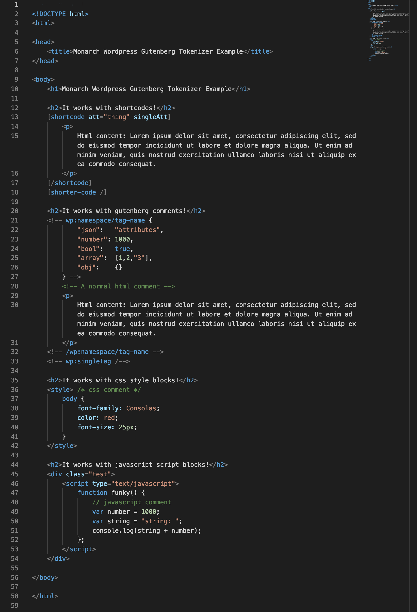

#  WPcode
A Wordpress admin code editor plugin using the Monaco code editor that powers VisualStudio Code. 

This is v3 of the existing [HTML Editor Syntax Highlighter](https://github.com/mukhortov/HESH-WordPress-Plugin) [Wordpress plugin](https://wordpress.org/plugins/html-editor-syntax-highlighter/), however it is a total rewrite using the [Monaco code editor](https://microsoft.github.io/monaco-editor/) rather than [CodeMirror](https://codemirror.net/).

## Status: Abandoned
I don't use wordpress anymore and don't have the bandwidth to contribute to this plugin. If you want to pick it up, send me a message. It did work for the classic text editor at some point, but I haven't tested it in a long time.

### Tokenizer
I did write a tokenizer for monaco that handles a hybrid of html, css, js, wp shortcodes, and gutenberg json comments.

---

## Run it
- `npm i`
- `npm start` to build and watch with livereload
- `npm run build` to build 

## Features (Goals)
- Code Editing In:
	- Classic Editor
	- Edit Theme
	- Edit Plugin
	- Additional Css in Customize
	- HTML widget
	- Gutenberg Blocks
		- Code Editor - gutenberg block comment + json
		- Gutenberg, View HTML mode of each block
		- html block
		- shortcode backwards compat
- Plugin Support:
- syntax highlighting for 
	- html+shortcodes 
	- html+gutenberg
	- html, css, js, php, other stuff in the the Theme/plugin editor
- settings page for setting your own json file... 
	- setting open anywhere but have a page as well.
- adding themes from the vscode store 
- full screen editor 
- emmet / autocomplete
- SAVING
	- save with command-s
	- restore cursor place
	- retain undo tree?
	- ajax save
- REVISION - diffing with older revisions
- Formatting button.
	- format code 
- works the same anywhere it is
- intellisense for shortcodes
- translate into other languages
- Better layout so scrolling doesn't suck
- linters?
### CONTENT SUPPORT
- wp auto p management
- create/manage child theme
- Scripts n styles
	- use less and define global variables and functions
	- js too
	- on global Customize page
	- tabbed interface?
- Global and Post ``
- Content Blocks - with visual button
	- Snippets
	- Define shortcodes - shortcoder plugin
	- Define blocks
### BUSINESS
- only paid, one-time pay?
- user-tracking
- terms of service
- maybes?
	- global find and replace - maybe only across certain content
	- integration with other plugins
	- detect HESH and warn
- adding vs-code extensions?
- copy pricing from:
	https://www.csshero.org/
	https://www.advancedcustomfields.com/

## Useful Links
- process user settings
	- [working with user metadata](https://developer.wordpress.org/plugins/users/working-with-user-metadata/)
	- [update_user_meta()](https://codex.wordpress.org/Function_Reference/update_user_meta)
- AJAX forms
	- [submitting a form in wordpress using ajax](https://teamtreehouse.com/community/submitting-a-form-in-wordpress-using-ajax)
	- [how to handle form submission](http://wordpress.stackexchange.com/questions/60758/how-to-handle-form-submission)
- [Ajax Save Post](https://wordpress.stackexchange.com/questions/60776/is-there-an-easy-way-to-ajax-ify-saving-of-post)
- [wp usage stats](https://wordpress.org/about/stats/)
- [Assets Info](https://developer.wordpress.org/plugins/wordpress-org/plugin-assets/)
- [WP SVN](https://developer.wordpress.org/plugins/wordpress-org/how-to-use-subversion/)

## Gutenberg Links
- [Gutenberg Hub, Other links](http://gutenberghub.com/gutenberg-developer-guide/)
- [Extend Blocks](https://wordpress.org/gutenberg/handbook/extensibility/extending-blocks/)
- [Gutenberg API](https://wordpress.org/gutenberg/handbook/)
- [Gutenberg HTML comment syntax](https://wordpress.org/gutenberg/handbook/language/#the-anatomy-of-a-serialized-block)
- [Events or hooks](https://wordpress.org/gutenberg/handbook/extensibility/extending-editor/)
- [`wp.data.getBlockMode()`](https://wordpress.org/gutenberg/handbook/designers-developers/developers/data/data-core-editor/#getblockmode)

## Logo info
https://code.visualstudio.com/blogs/2017/10/24/theicon
https://blogs.msdn.microsoft.com/visualstudio/2017/03/08/iterations-on-infinity/

## Other notes

### Options for `wpautop`
- __TinyMCE Advanced:__ has an option to _Keep paragraph tags_
	- this option disables `wpautop` content filter and re-implements it in js
	- search for `noAutop` in _mce/wptadv/plugin.js_
	- this causes other problems [apparently](https://wordpress.org/support/topic/plugin-tinymce-advanced-stop-removing-the-ltpgt-and-ltbr-gt-tags-cant-add-html-comments/#topic-1449977-replies)
- __Gutenberg__ maybe use the gutenberg js version of [`autop`](https://wordpress.org/gutenberg/handbook/designers-developers/developers/packages/packages-autop/) js in conjunction with the disabling the pp `wpautop` content filter
- Preserved HTML Editor Markup Plus Plugin ?

### Formatting HTML
- [html tidy](http://www.html-tidy.org/) is [included](http://php.net/manual/en/tidy.examples.basic.php) in some php apparently
- [js beautify](https://github.com/beautify-web/js-beautify) is what [vs code uses](https://code.visualstudio.com/docs/languages/html#_formatting)
- replace shortcode `[brackets][/brackets]` with `<@brackets @></@brackets @>`, beautify, and then replace them back.
- test on [beautifier.io](https://beautifier.io/)
- beautify for gutenberg-html-comment-json could run selectively in comment blocks as a separate operation
